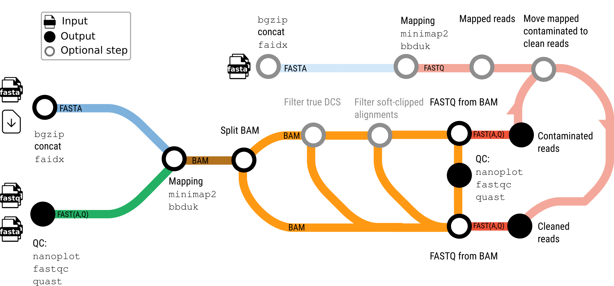

# Clean your data!

A decontamination workflow for short reads, long reads and assemblies.


Email: hoelzerm@rki.de, lataretum@rki.de

## Objective

Sequencing data is often contaminated with DNA or RNA from other species. These, normally unwanted, material occurs for biological reasons or can be also spiked in as a control. For example, this is often the case for Illumina data ([phiX phage](https://environmentalmicrobiome.biomedcentral.com/articles/10.1186/1944-3277-10-18)) or Oxford Nanopore
Technologies ([DNA CS (DCS)](https://assets.ctfassets.net/hkzaxo8a05x5/2IX56YmF5ug0kAQYoAg2Uk/159523e326b1b791e3b842c4791420a6/DNA_CS.txt), [yeast ENO2](https://www.yeastgenome.org/locus/S000001217)). Most tools don't take care of such contaminations and thus we can find them in sequence collections and asssemblies ([Mukherjee _et al_. (2015)](https://environmentalmicrobiome.biomedcentral.com/articles/10.1186/1944-3277-10-18)).

## What this workflow does for you

With this workflow you can screen and clean your Illumina, Nanopore or any FASTA-formated sequence data. The results are the clean sequences and the sequences identified as contaminated.
Per default [minimap2](https://github.com/lh3/minimap2) is used for aligning your sequences to reference sequences but I recommend using `bbduk`, part of [BBTools](https://github.com/BioInfoTools/BBMap), to clean short-read data (_--bbduk_).

You can simply specify provided hosts and controls for the cleanup or use your own FASTA files. The reads are then mapped against the specified host, control and user defined FASTA files. All reads that map are considered as contamination. In case of Illumina paired-end reads, both mates need to be aligned.

If Nanopore (`--input_type nano`) and Illumina (`--input_type illumina`) reads and control(s) (`--control`) are set, the control is selectively concatenated with the host and own FASTA: `dcs` for Nanopore DNA-Seq, `eno` for Nanopore RNA-Seq and `phix` from Illumina data.
Else, specified host, control and user defined FASTA files are concatenated.

### Filter soft-clipped contamination reads

We saw many soft-clipped reads after the mapping, that probably aren't contamination. With `--min_clip` the user can set a threshold for the number of soft-clipped positions (sum of both ends). If `--min_clip` is greater 1, the total number is considered, else the fraction of soft-clipped positions to the read length. The output consists of all mapped, soft-clipped and mapped reads passing the filer.

## Requirements

### Workflow management

- [Nextflow](https://www.nextflow.io/docs/latest/getstarted.html#installation)

### Dependencies management

- [Conda](https://docs.conda.io/en/latest/miniconda.html)

and/or

- [Docker](https://docs.docker.com/get-docker/)

In default `docker` is used; to switch to `conda` use `-profile conda`.

## Execution examples

Get or update the workflow:

```bash
nextflow pull hoelzer/clean
```

Get help:

```bash
nextflow run hoelzer/clean --help
```

Clean Nanopore data by filtering against a combined reference of the _E. coli_ genome and the Nanopore DNA CS spike-in.

```bash
# uses Docker per default
nextflow run hoelzer/clean --input_type nano --input ~/.nextflow/assets/hoelzer/clean/test/nanopore.fastq.gz \
--host eco --control dcs

# use conda instead of Docker
nextflow run hoelzer/clean --input_type nano --input ~/.nextflow/assets/hoelzer/clean/test/nanopore.fastq.gz \
--host eco --control dcs -profile conda
```

Clean Illumina paired-end data against your own reference FASTA using bbduk instead of minimap2.

```bash
# enter your home dir!
nextflow run hoelzer/clean --input_type illumina --input '/home/martin/.nextflow/assets/hoelzer/clean/test/illumina*.R{1,2}.fastq.gz' \
--own ~/.nextflow/assets/hoelzer/clean/test/ref.fasta.gz --bbduk
```

Clean some Illumina, Nanopore, and assembly files against the mouse and phiX genomes.

## Supported species and control sequences

Currently supported are:

|flag | species | source|
|-----|---------|-------|
|hsa  | _Homo sapiens_       | [Ensembl: Homo_sapiens.GRCh38.dna.primary_assembly] |
|mmu  | _Mus musculus_       | [Ensembl: Mus_musculus.GRCm38.dna.primary_assembly] |
|csa  | _Chlorocebus sabeus_ | [NCBI: GCF_000409795.2_Chlorocebus_sabeus_1.1_genomic] |
|gga  | _Gallus gallus_      | [NCBI: Gallus_gallus.GRCg6a.dna.toplevel] |
|cli  | _Columba livia_      | [NCBI: GCF_000337935.1_Cliv_1.0_genomic] |
|eco  | _Escherichia coli_   | [Ensembl: Escherichia_coli_k_12.ASM80076v1.dna.toplevel] |
|sc2  | _SARS-CoV-2_         | [ENA Sequence: MN908947.3 (Wuhan-Hu-1 complete genome) [web](https://www.ebi.ac.uk/ena/browser/view/MN908947.3) [fasta](https://www.ebi.ac.uk/ena/browser/api/fasta/MN908947.3?download=true)] |

Included in this repository are:

|flag | recommended usage | control/spike | source |
|-----|-|---------|-------|
| dcs | ONT DNA-Seq reads |3.6 kb standard amplicon mapping the 3' end of the Lambda genome| https://assets.ctfassets.net/hkzaxo8a05x5/2IX56YmF5ug0kAQYoAg2Uk/159523e326b1b791e3b842c4791420a6/DNA_CS.txt |
| eno | ONT RNA-Seq reads |yeast ENO2 Enolase II of strain S288C, YHR174W| https://raw.githubusercontent.com/hoelzer/clean/master/controls/S288C_YHR174W_ENO2_coding.fsa |
| phix| Illumina reads |enterobacteria_phage_phix174_sensu_lato_uid14015, NC_001422| ftp://ftp.ncbi.nlm.nih.gov/genomes/Viruses/enterobacteria_phage_phix174_sensu_lato_uid14015/NC_001422.fna |

... for reasons. More can be easily added! Just write me, add an issue or make a pull request.

## Workflow



<sub><sub>The icons and diagram components that make up the schematic view were originally designed by James A. Fellow Yates & nf-core under a CCO license (public domain).</sub></sub>

## Results

Running the pipeline will create a directory called `results/` in the current directory with some or all of the following directories and files (plus additional failes for indices, ...):

```text
results/
├── clean/
│   └── <sample_name>.fastq.gz
├── removed/
│   └── <sample_name>.fastq.gz
├── intermediate/
│   ├── map-to-remove/
│   │   ├── <sample_name>.mapped.fastq.gz
│   │   ├── <sample_name>.unmapped.fastq.gz
│   │   ├── <sample_name>.mapped.bam
│   │   ├── <sample_name>.unmapped.bam
│   │   ├── strict-dcs/
│   │   │   ├── <sample_name>.no-dcs.bam
│   │   │   ├── <sample_name>.true-dcs.bam
│   │   │   └── <sample_name>.false-dcs.bam
│   │   └── soft-clipped/
│   │       ├── <sample_name>.soft-clipped.bam
│   │       └── <sample_name>.passed-clipped.bam
│   └── map-to-keep/
│       ├── <sample_name>.mapped.fastq.gz
│       ├── <sample_name>.unmapped.fastq.gz
│       ├── <sample_name>.mapped.bam
│       ├── <sample_name>.unmapped.bam
│       ├── strict-dcs/
│       │   ├── <sample_name>.no-dcs.bam
│       │   ├── <sample_name>.true-dcs.bam
│       │   └── <sample_name>.false-dcs.bam
│       └── soft-clipped/
│           ├── <sample_name>.soft-clipped.bam
│           └── <sample_name>.passed-clipped.bam
├── logs/*.html
└── qc/multiqc_report.html
```

The most important files you are likely interested in are `results/clean/<sample_name>.fastq.gz`, which are the "cleaned" reads. These are the input reads that *do not* map to the host, control, own fasta or rRNA files (or the subset of these that you provided), plus those reads that map to the "keep" sequence if you used the `--keep` option. Any files that were removed from your input fasta file are placed in `results/removed/<sample_name>.fastq.gz`.

For debugging purposes we also provide various intermediate results in the `intermediate/` folder.

## Citations

If you use `CLEAN` in your work, please consider citing our preprint:

> Targeted decontamination of sequencing data with CLEAN
>
> Marie Lataretu, Sebastian Krautwurst, Adrian Viehweger, Christian Brandt, Martin Hölzer
>
> bioRxiv 2023.08.05.552089; doi: https://doi.org/10.1101/2023.08.05.552089

Additionally, an extensive list of references for the tools used by the pipeline can be found in the [`CITATIONS.md`](CITATIONS.md) file.
